# Proyecto_De_datos_a_decisiones_de_negocio
Análisis end-to-end del servicio de suscripción RappiPlus: calidad de datos, rentabilidad (revenue, costos, utilidad), funnel de conversión, retención por cohortes y experimento A/B en checkout con Python y SQL, comunicado en un dashboard ejecutivo en Power BI.
# Proyecto RappiPlus: de datos a decisiones de negocio

## Resumen ejecutivo del proyecto

**Objetivo:** evaluar el desempeño del servicio de suscripción **RappiPlus** para responder seis preguntas de negocio: si los datos son confiables, si el negocio es rentable, dónde se pierden los usuarios en el proceso de compra, si los usuarios regresan, si un cambio en el checkout tuvo impacto, y cómo comunicar todo esto a través de un dashboard.

> Este README presenta únicamente los **resultados, visualizaciones e insights de negocio**.
> El análisis completo, la limpieza de datos, las consultas SQL y el código reproducible se encuentran en [`S12_Proyecto_RappiPlus_De_datos_a_decisiones_de_negocio.ipynb`](./S12_Proyecto_RappiPlus_De_datos_a_decisiones_de_negocio.ipynb).

---

## Tabla de contenido

- [Tecnologías utilizadas](#tecnologías-utilizadas)
- [Fuentes de datos](#fuentes-de-datos)
- [Paso 1: Calidad de los datos](#paso-1-calidad-de-los-datos)
- [Paso 2: Rentabilidad del negocio](#paso-2-rentabilidad-del-negocio)
- [Outliers: la Laptop-Gaming-16GB que casi rompe el balance](#outliers-la-laptop-gaming-16gb-que-casi-rompe-el-balance)
- [Paso 3: Funnel de conversión](#paso-3-funnel-de-conversión)
- [Paso 4: Retención por cohortes](#paso-4-retención-por-cohortes)
- [Paso 5: Experimento A/B en el checkout](#paso-5-experimento-ab-en-el-checkout)
- [Paso 6: Dashboard en Power BI](#paso-6-dashboard-en-power-bi)
- [Conclusión y recomendaciones de negocio](#conclusión-y-recomendaciones-de-negocio)

---

## Tecnologías utilizadas

`Python` · `Jupyter Notebook` · `pandas` · `NumPy` · `Seaborn` · `Matplotlib` · `SQL (PostgreSQL)` · `SQLAlchemy` · `statsmodels` · `Power BI`

**Técnicas aplicadas:** validación y limpieza de datos, cálculo de KPIs de negocio (revenue, costo, utilidad, ROAS), detección de outliers mediante boxplots, análisis de funnel de conversión con SQL, análisis de retención por cohortes, prueba Z para dos proporciones, y construcción de un dashboard ejecutivo multi-página en Power BI.

[↑ Volver al inicio](#proyecto-rappiplus-de-datos-a-decisiones-de-negocio)

---

## Fuentes de datos

| Fuente | Contenido | Herramienta |
|---|---|---|
| `rappiplus_orders_raw.csv` | Pedidos: producto, cantidad, precio, descuento, monto total | Python |
| `rappiplus_catalog.csv` | Costo unitario y proveedor por producto | Python |
| `rappiplus_marketing_spend.csv` | Inversión en marketing por país y canal | Python |
| `events` (SQL) | Eventos del usuario dentro del funnel de compra | SQL |
| `users` / `user_activity` (SQL) | Registro y actividad de usuarios para retención | SQL |
| `experiment_checkout_ui.csv` | Resultados del experimento A/B en el checkout | Python |

[↑ Volver al inicio](#proyecto-rappiplus-de-datos-a-decisiones-de-negocio)

---

## Paso 1: Calidad de los datos

**Pregunta del negocio:** ¿podemos confiar en los datos?

Se validaron los tres datasets base (`orders`, `catalog`, `marketing`):

- Conversión de fechas a formato `datetime`.
- Revisión de negativos, ceros inválidos y duplicados.
- Recuperación de valores nulos en `pais` y `dispositivo` a partir del historial del propio usuario (un usuario, un país y un dispositivo).
- Homologación de categorías (por ejemplo, `Electrónica` con y sin acento entre `catalog` y `orders`).
- Detección de outliers en `orders` mediante boxplot.

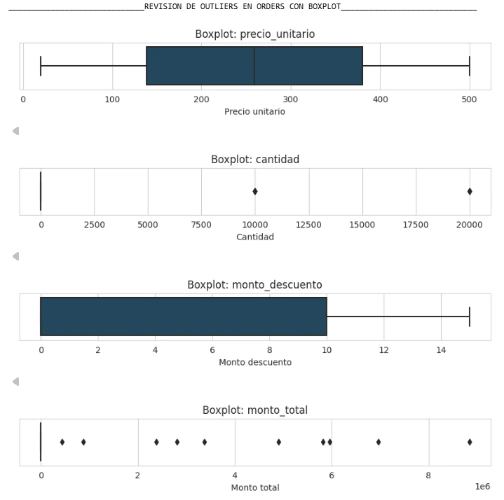

El boxplot de `cantidad` mostró pedidos con volúmenes anómalos (10,000 y 20,000 unidades en una sola compra), muy por encima del promedio. Se marcaron como **bandera de outliers** para poder analizar el negocio con y sin ellos, en lugar de eliminarlos sin más: esa decisión resultó clave en el paso siguiente.

**Entregable:** `orders_clean.csv`, `catalog_clean.csv`, `marketing_clean.csv`.

[↑ Volver al inicio](#proyecto-rappiplus-de-datos-a-decisiones-de-negocio)

---

## Paso 2: Rentabilidad del negocio

**Pregunta del negocio:** ¿el negocio realmente está generando ganancias?

| KPI | Monto | % sobre ingreso |
|---|---|---|
| Ingreso total | $51,966,982.4 | 100% |
| Costo total | $43,124,069.0 | 82.98% |
| Utilidad bruta | $8,842,913.4 | 17.02% |
| Inversión en marketing | ≈ $2,872,842.3 | 5.53% |
| **Utilidad neta** | **$5,971,069.8** | **11.49%** |

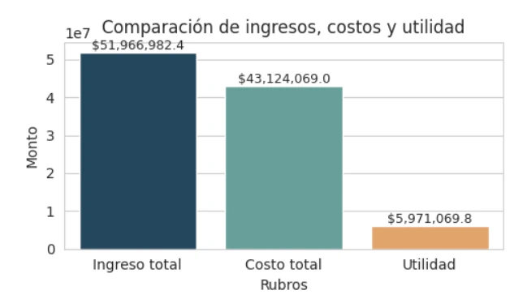

RappiPlus **sí es rentable**, pero el margen neto (11.5%) es sensible al costo de producto y al gasto de marketing: casi 6 centavos de cada dólar de ingreso se destinan a adquisición.

**Comportamiento de ventas (excluyendo outliers):**

- Ticket promedio: **$385.9**
- Cantidad promedio de productos por orden: **1.5**
- ROAS general: **18.1x** (por cada dólar invertido en marketing, se generaron $18.1 en ventas)

**Inversión y retorno por campaña:**

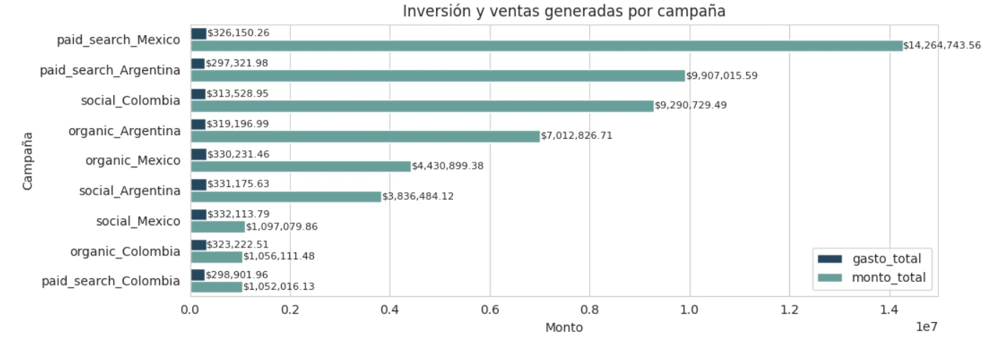

`paid_search_Mexico` fue la campaña con mayor retorno absoluto (~$14.3M en ventas con ~$326K de inversión), seguida por `paid_search_Argentina` y `social_Colombia`. El canal orgánico también aporta un volumen relevante de ventas sin costo de adquisición directo.

[↑ Volver al inicio](#proyecto-rappiplus-de-datos-a-decisiones-de-negocio)

---

## Outliers: la Laptop-Gaming-16GB que casi rompe el balance

Al comparar costo, monto y utilidad por producto **con y sin outliers**, un solo producto distorsiona por completo la lectura del negocio:

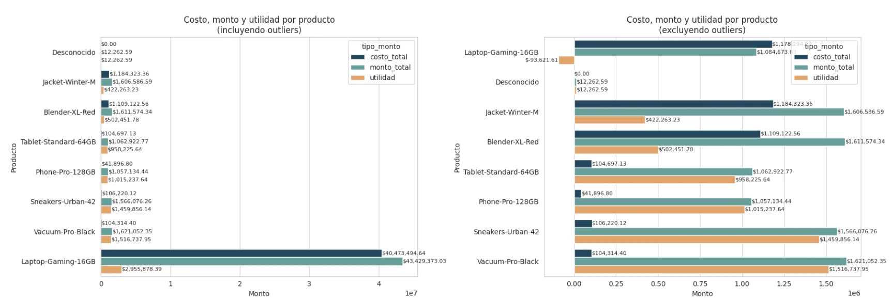

Incluyendo los outliers, `Laptop-Gaming-16GB` concentra **$40.5M** en costos frente a solo **$3M** de utilidad — un resultado que arrastra la rentabilidad general del catálogo hacia abajo únicamente por un puñado de pedidos.

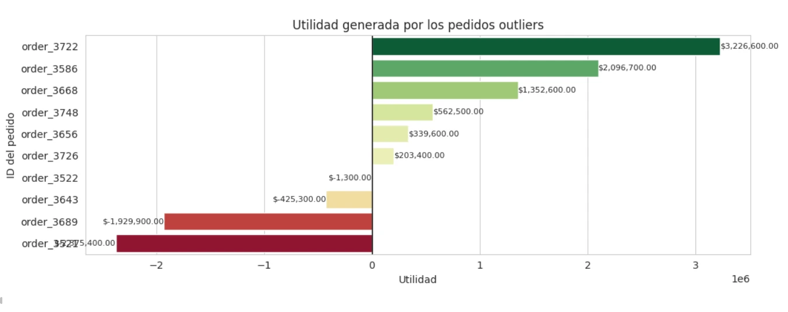

**Anomalías en precio unitario y volumen — producto Laptop-Gaming-16GB:**

- **Cuatro ventas acumulan una pérdida de -$4,731,900**; seis ventas acumulan una utilidad de **$7,781,400**. Una sola orden (`order_3722`, Argentina, 20,000 unidades) determina si el periodo cierra en ganancia o pérdida.
- Dos órdenes (`order_3521` y `order_3689`) muestran precio unitario muy por debajo del costo unitario ($280.68).
- Los usuarios asociados a ambas órdenes no registran ninguna otra compra en el sistema, ni antes ni después del evento.
- Ambas órdenes se colocaron en domingo, día de menor supervisión operativa habitual.
- Ningún otro comprador ese mismo día realizó compras en volúmenes comparables.

**Recomendación:** un error de esta magnitud representa un riesgo de inventario recurrente — la combinación de precio muy por debajo de costo y ausencia de límite de cantidad pudo, en principio, vaciar el inventario disponible del producto en una sola transacción. Se recomienda **auditar urgentemente** la cuenta, usuario y cliente involucrados para descartar fraude, y revisar si existe un control de validación que impida `cantidad × precio` muy por debajo del costo unitario en futuras órdenes.

[↑ Volver al inicio](#proyecto-rappiplus-de-datos-a-decisiones-de-negocio)

---

## Paso 3: Funnel de conversión

**Pregunta del negocio:** ¿dónde se pierden los usuarios en el proceso de compra?

Analizado con SQL sobre la tabla `events`, siguiendo el recorrido `first_visit → select_item → add_to_cart → begin_checkout → add_payment_info → purchase`.

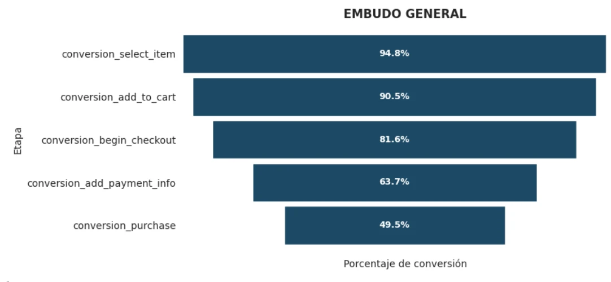

| Etapa | Conversión acumulada |
|---|---|
| select_item | 94.8% |
| add_to_cart | 90.5% |
| begin_checkout | 81.6% |
| add_payment_info | 63.7% |
| **purchase (conversión final)** | **49.5%** |

**Hallazgos:**

- La **mayor caída** ocurre entre `begin_checkout` y `add_payment_info`: **17.92 puntos porcentuales**.
- La **segunda mayor caída** ocurre entre `add_payment_info` y `purchase`: **14.24 puntos porcentuales**.
- Casi la mitad de los usuarios que inician el checkout no completan la compra.

**Insight:** la fricción se concentra en el tramo de pago, no en el descubrimiento del producto. Se sugiere identificar la causa puntual — formulario largo, falta de opciones de envío, o costos inesperados (impuestos o envío) que aparecen recién en esta etapa.

[↑ Volver al inicio](#proyecto-rappiplus-de-datos-a-decisiones-de-negocio)

---

## Paso 4: Retención por cohortes

**Pregunta del negocio:** ¿los usuarios regresan después de registrarse?

Analizado con SQL sobre `users` (8,000 registros) y `user_activity` (32,000 registros), construyendo cohortes semanales por mes de registro.

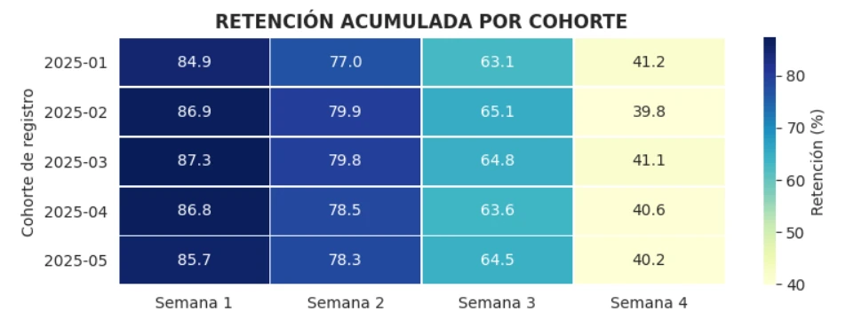

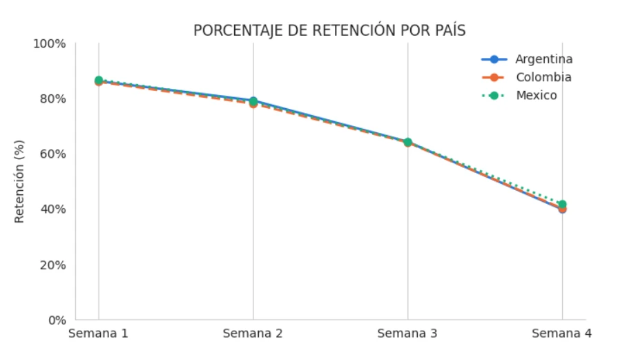

**Hallazgos principales:**

- Los países y las cohortes se comportan de manera prácticamente homogénea entre sí.
- La retención se reduce **a la mitad** entre la semana 1 (≈86%) y la semana 4 (≈40%).
- Caída por tramos: semana 1→2: **7%** · semana 2→3: **14%** · semana 3→4: **23%**.
- La caída de semana 3 a semana 4 es la mayor fuga de usuarios: **casi el doble** que el tramo anterior y **más del triple** que el primer tramo.
- El tipo de plan explica la mayor diferencia de retención (no el país ni el dispositivo): en semana 4, los usuarios de plan **pagado retienen ≈57%** frente a **≈35% del plan gratuito**, una brecha de ~22.6 puntos porcentuales.

**Insight de negocio:** conviene actuar **entre la semana 2 y la semana 3**, antes de que ocurra la mayor caída, con notificaciones push, correos de reactivación o incentivos tipo "vuelve por X", en lugar de esperar hasta la cuarta semana cuando el usuario probablemente ya abandonó. También se recomienda investigar qué características del plan pagado favorecen la retención, para evaluar incorporarlas parcialmente al plan gratuito — sin asumir causalidad todavía, ya que quienes pagan pueden tener mayor intención de uso desde el inicio.

[↑ Volver al inicio](#proyecto-rappiplus-de-datos-a-decisiones-de-negocio)

---

## Paso 5: Experimento A/B en el checkout

**Pregunta del negocio:** ¿el cambio en la UI del checkout generó impacto?

**Hipótesis:**
- **H₀:** no existe diferencia estadísticamente significativa en la tasa de conversión entre `control` y `tratamiento`.
- **H₁:** la tasa de conversión difiere entre `control` y `tratamiento`.

**Test estadístico:** prueba Z para dos proporciones · **α = 0.05** (95% de confianza)

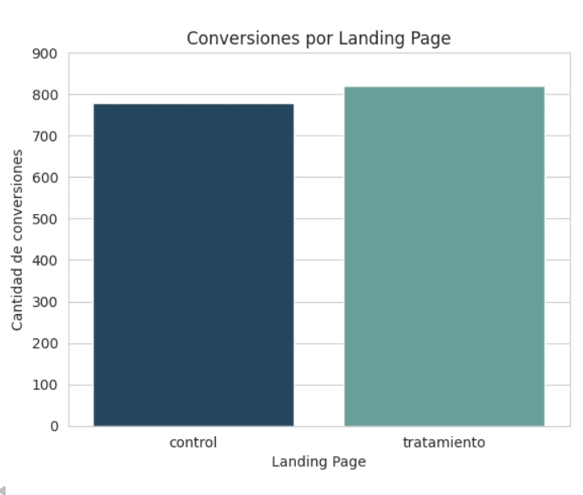

| Variante | Conversiones | Tasa de conversión |
|---|---|---|
| Control | 779 | 15.69% |
| Tratamiento | 820 | 16.29% |
| **Diferencia** | +41 | **+0.60 pp** |

**Resultado:** con un nivel de significancia del 5%, **no se rechaza H₀** — no hay evidencia estadísticamente significativa de que la tasa de conversión difiera entre el checkout de control y el de tratamiento.

**Interpretación de negocio:** aunque el tratamiento muestra más conversiones en términos absolutos, la diferencia observada (0.6 pp) es compatible con variabilidad aleatoria. **No se recomienda migrar al nuevo checkout basándose únicamente en este resultado**; se sugiere ampliar el tamaño de muestra o el periodo de prueba antes de tomar una decisión definitiva.

[↑ Volver al inicio](#proyecto-rappiplus-de-datos-a-decisiones-de-negocio)

---

## Paso 6: Dashboard en Power BI

**Pregunta del negocio:** ¿cómo comunicamos todo esto de forma clara y accionable?

Con los CSVs limpios del Paso 1 se construyó un dashboard ejecutivo de 5 páginas en Power BI.

### Overview Ejecutivo
KPIs de negocio (ingreso, utilidad, ROAS, ticket promedio), evolución mensual de utilidad e ingresos acumulados YTD/MTD, e ingreso/utilidad por producto.

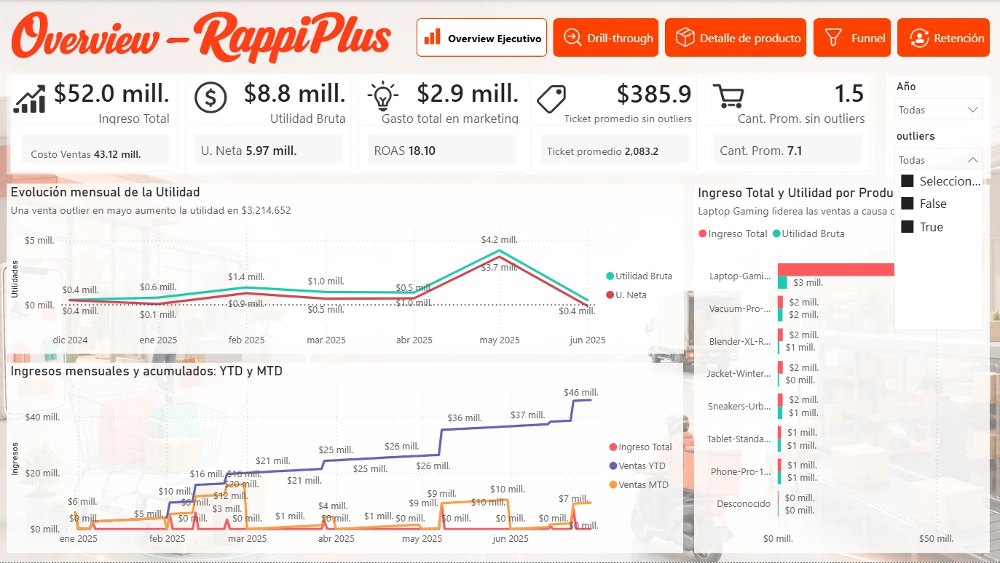

### Drill-through
Exploración del KPI general hasta el detalle de la anomalía en `Laptop-Gaming-16GB`, con ingreso y utilidad bruta por país.

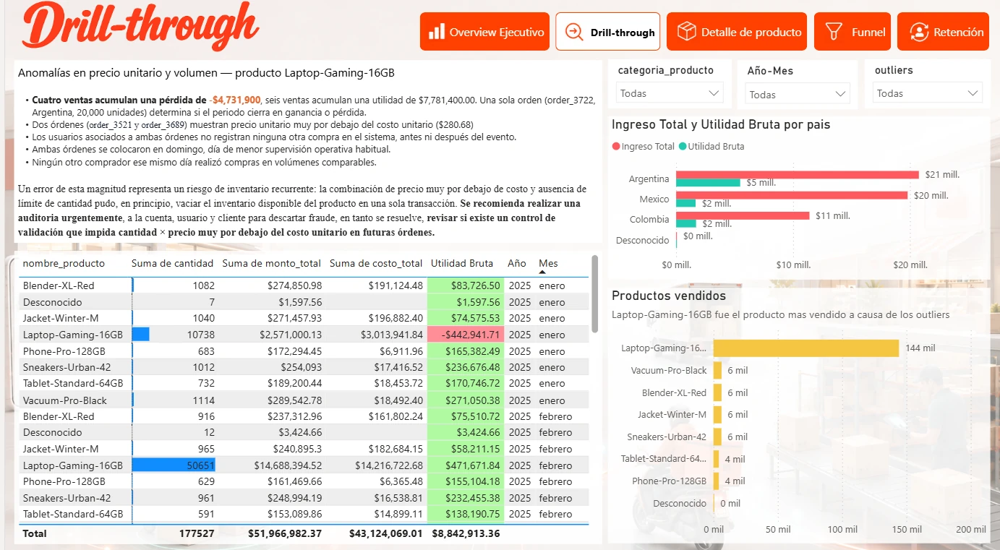

### Detalle de producto
Tabla transaccional filtrable con cada pedido, costo, monto y utilidad.

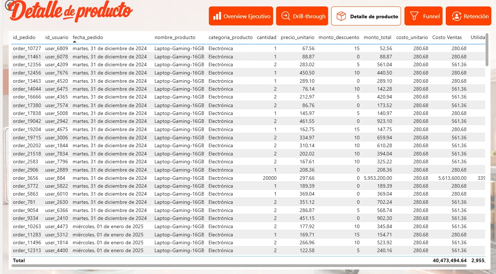

### Funnel
Embudo de conversión interactivo, filtrable por país, con el detalle de la mayor caída.

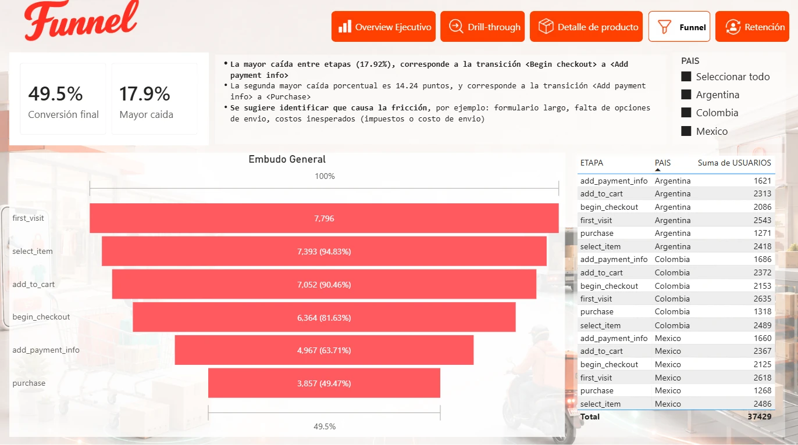

### Retención
Retención acumulada por cohorte, país, tipo de plan y dispositivo, con insights de negocio integrados en el panel lateral.

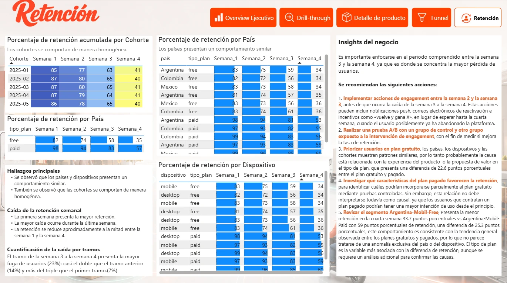

[↑ Volver al inicio](#proyecto-rappiplus-de-datos-a-decisiones-de-negocio)

---

## Conclusión y recomendaciones de negocio

### Diagnóstico general

RappiPlus **es rentable** (utilidad neta de $5.97M, 11.5% del ingreso, ROAS de 18.1x), pero ese resultado esconde tres riesgos concretos:

1. **Riesgo operativo:** una sola orden anómala (`order_3722`) puede definir si el periodo cierra en ganancia o pérdida. El catálogo necesita un control de validación de `cantidad × precio` vs. costo unitario.
2. **Riesgo de conversión:** casi 1 de cada 2 usuarios que llega a `first_visit` no completa la compra, y el 32% de esa fuga ocurre solo en el tramo de checkout (`begin_checkout → purchase`).
3. **Riesgo de retención:** la mitad de los usuarios se pierde en las primeras 4 semanas, con la mayor fuga justo antes de la semana 4 — y el plan gratuito retiene ~22 puntos menos que el pagado.

### Recomendaciones priorizadas

- **Auditar la anomalía de `Laptop-Gaming-16GB`** y bloquear pedidos con precio muy por debajo del costo unitario.
- **Rediseñar el checkout** enfocándose en `begin_checkout → add_payment_info`, la etapa de mayor fricción del funnel.
- **Activar campañas de re-engagement entre la semana 2 y 3** de vida del usuario, antes de la mayor caída de retención.
- **Investigar qué impulsa la retención del plan pagado** para evaluar incorporar esos beneficios, parcial o condicionalmente, al plan gratuito.
- **No migrar aún al nuevo checkout probado en el experimento A/B**: la diferencia de conversión (+0.6 pp) no es estadísticamente significativa; se recomienda repetir la prueba con mayor muestra o duración.

### Consideraciones

Estas recomendaciones asumen que no existieron factores externos que afectaran de forma desigual a los grupos analizados (campañas simultáneas, cambios de tráfico, errores técnicos). Se recomienda dar seguimiento continuo a utilidad neta, tasa de conversión del funnel y retención por tipo de plan como métricas de control tras cualquier cambio implementado.

[↑ Volver al inicio](#proyecto-rappiplus-de-datos-a-decisiones-de-negocio)
